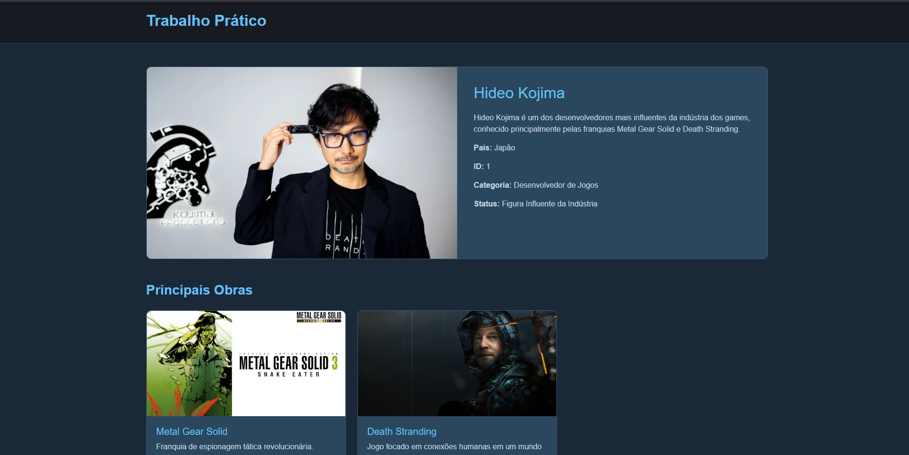

[](https://classroom.github.com/a/F2TzckGO)
# Trabalho Prático - Semana 13

Home com cards e página de detalhes com JSON Server 
Nesta atividade, você vai migrar a estrutura de dados que estava dentro do arquivo JavaScript para um arquivo db.json e utilizar o JSON Server como um “backend” simples para o seu projeto. Para este ambiente local de desenvolvimento, utilizamos além do JSONServer, o Node.js.
IMPORTANTE: Assim como informado anteriormente, capriche na etapa pois você vai precisar dessa parte para as próximas semanas. 

## Informações Gerais

- Nome: Yandi Orlando Santos Rivero
- Matricula: 909840

## Prints do trabalho
### Tela de cards: 

### Tela de detalhes do produto: 


## Como executar

1. npm install -g json-server ( no terminal command prompt )
2. entre na pasta raiz do site
3. json-server --watch db/db.json --static public --port 3000
4. Acesse no navegador: http://localhost:3000

## Estrutura do db.json
 
### Coleções
 
| Coleção | Descrição |
|---|---|
| `desenvolvedores` | Coleção principal com os desenvolvedores exibidos nos cards e na página de detalhes |
 
### Exemplo de item
 
```json
{
  "id": 1,
  "nome": "Hideo Kojima",
  "descricao": "Criador de experiências cinematográficas e narrativas complexas.",
  "conteudo": "Hideo Kojima é um dos desenvolvedores mais influentes da indústria dos games...",
  "pais": "Japão",
  "destaque": true,
  "imagem": "assets/img/kojima.png",
  "obras": [
    {
      "nome": "Metal Gear Solid",
      "descricao": "Franquia de espionagem tática revolucionária.",
      "imagem": "assets/img/atracoes/metalgearsolid.jpg"
    }
  ]
}
```
 
### Campos
 
| Campo | Tipo | Descrição |
|---|---|---|
| `id` | number | Identificador único |
| `nome` | string | Nome do desenvolvedor |
| `descricao` | string | Texto curto exibido nos cards |
| `conteudo` | string | Descrição completa exibida na página de detalhes |
| `pais` | string | País de origem |
| `destaque` | boolean | Se `true`, aparece no carousel da Home |
| `imagem` | string | Caminho da imagem do desenvolvedor |
| `obras` | array | Lista de obras com nome, descrição e imagem |